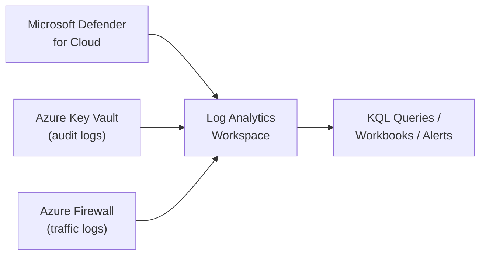

# Azure Cloud Security & Monitoring Lab

A hands-on, IaC-first lab covering the four fundamentals of Azure cloud security: **Microsoft Defender for Cloud** (workload protection), **Azure Key Vault** (key/secret management), **Azure Firewall** (network filtering), and a **Log Analytics workspace** (centralized monitoring) — everything wired together so logs actually flow somewhere queryable.

Companion lab for the article [Cloud Security and Monitoring in Azure](https://raphaelgmomoh.pages.dev/articles/azure-cloud-security-and-monitoring-fundamentals).

---

## How the Pieces Connect



---

## Repository Structure

```text
.
├── README.md
└── src/
    ├── bicep/
    │   ├── main.bicep              # Orchestrates all four resources
    │   ├── log-analytics.bicep     # Log Analytics workspace module
    │   ├── key-vault.bicep         # RBAC-authorized, purge-protected vault
    │   └── firewall.bicep          # Hub VNet + AzureFirewallSubnet + policy
    ├── scripts/
    │   ├── enable-defender.sh      # Enable Defender plans per workload type
    │   └── connect-diagnostics.sh  # Wire Key Vault + Firewall logs to the workspace
    ├── queries/
    │   ├── defender-high-severity-alerts.kql
    │   ├── keyvault-secret-access-audit.kql
    │   └── firewall-denied-traffic.kql
    └── workbooks/
        └── security-dashboard.workbook.json   # All four panels below, ready to import
```

---

## Quick Start

### 1. Deploy the core infrastructure (Bicep)

```bash
az group create --name rg-security-lab --location eastus

az deployment group create \
  --resource-group rg-security-lab \
  --template-file src/bicep/main.bicep \
  --parameters environmentName=lab
```

This provisions the Log Analytics workspace, an RBAC-authorized Key Vault with soft-delete and purge protection enabled, and a hub VNet with Azure Firewall + a default-deny policy.

### 2. Enable Defender for Cloud plans

```bash
./src/scripts/enable-defender.sh
```

Enables Defender plans only for the workload types actually deployed — edit the script's plan list to match your subscription before running.

### 3. Wire diagnostic logs into the workspace

```bash
./src/scripts/connect-diagnostics.sh rg-security-lab
```

### 4. Run the queries

Open any file in `src/queries/` in the Log Analytics workspace's **Logs** blade, or via CLI:

```bash
az monitor log-analytics query \
  --workspace "<workspace-id>" \
  --analytics-query "$(cat src/queries/firewall-denied-traffic.kql)"
```

### 5. Import the Workbook (all four panels, no manual panel-building)

`src/workbooks/security-dashboard.workbook.json` combines the three queries above with a Secure Score trend panel. In the Azure Portal: **Monitor > Workbooks > New > Advanced Editor**, paste the file's contents, then point it at your Log Analytics workspace.

One panel needs a prerequisite this repo doesn't automate yet: the Secure Score trend query reads from the `SecureScores` table, which only populates if **Continuous Export** is enabled from Defender for Cloud to this workspace (Defender for Cloud > Environment settings > Continuous export > Secure score). Without that export configured, the other three panels (Defender alerts, Key Vault audit, Firewall deny-rate) still work — only the Secure Score panel will show no data.

---

## License

MIT — use it, fork it, adapt it to your own environment.
